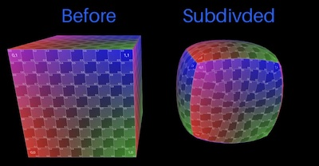

# Three Subdivide

This modifier uses the [Loop](https://en.wikipedia.org/wiki/Loop_subdivision_surface) (Charles Loop, 1987) subdivision surface algorithm to smooth modern three.js [BufferGeometry](https://threejs.org/docs/?q=geometry#api/en/core/BufferGeometry).

## Examples

- <a href='https://stevinz.github.io/three-subdivide/LoopSubdivision.html'>Three.js Built-In Geometries</a>

- <a href='https://stevinz.github.io/three-subdivide/MorphTargets.html'>Morph Target Animation</a>

## Screenshot

<p align="center"></p>

## Background

&nbsp;&nbsp;&nbsp;&nbsp;&nbsp;&nbsp;&nbsp;At one point, [three.js](https://threejs.org/) included a subdivision surface modifier in the extended examples, it was removed in r125. This modifier was originally based on the [Catmull-Clark](https://en.wikipedia.org/wiki/Catmull%E2%80%93Clark_subdivision_surface) algorithm, which works best for geometry with convex coplanar n-gon faces. In three.js r60 the modifier was changed to use the Loop algorithm, which was designed to work better with triangle based meshes.

&nbsp;&nbsp;&nbsp;&nbsp;&nbsp;&nbsp;&nbsp;The Loop algorithm, however, doesn't always provide uniform results as the vertices are skewed toward the most used vertex positions. A triangle box (like `BoxGeometry` for example) will favor some corners more than others. To alleviate this issue, this implementation includes an initial pass to split coplanar faces at their shared edges. It starts by splitting along the longest shared edge first, and then from that midpoint it splits to any remaining coplanar shared edges. This can be disabled by passing 'split' as false.
</div>

&nbsp;&nbsp;&nbsp;&nbsp;&nbsp;&nbsp;&nbsp;Also by default, this implementation inserts new UV coordinates, but does not average them using the Loop algorithm. In some cases (often in flat geometries) this will produce undesired results, a noticeable tearing will occur. In such cases, try passing 'uvSmooth' as true to enable UV averaging.

## Install

- Option 1: Copy file `LoopSubdivision.js`, import from file...

```javascript
import { LoopSubdivision } from 'LoopSubdivision.js';
```

- Option 2: Install from [npm](https://www.npmjs.com/package/three-subdivide), import from 'three-subdivide'...
```
npm install three-subdivide
```
```javascript
import { LoopSubdivision } from 'three-subdivide';
```

- Option 3: Import directly from CDN...
```javascript
import { LoopSubdivision } from 'https://unpkg.com/three-subdivide/build/index.module.js';
```

## Usage

To create subdivided geometry, use the static function `modify()`. The following code creates a cube with smoothed geometry and adds it to a three.js `Scene`.

```javascript
import * as THREE from 'three';
import { LoopSubdivision } from 'LoopSubdivision.js';

const iterations = 1;

const params = {
    split:          true,       // optional, default: true
    uvSmooth:       false,      // optional, default: false
    preserveEdges:  false,      // optional, default: false
    flatOnly:       false,      // optional, default: false
    maxTriangles:   Infinity,   // optional, default: Infinity
};

const geometry = LoopSubdivision.modify(new THREE.BoxGeometry(), iterations, params);

const material = new THREE.MeshNormalMaterial();
const mesh = new THREE.Mesh(geometry, material);

const scene = new THREE.Scene();
scene.add(mesh);
```

## Modify

LoopSubdivision.modify(bufferGeometry, iterations = 1, params = {}) {

- [bufferGeometry]() : BufferGeometry - existing three.js BufferGeometry object to be subdivided
- [iterations]() : Int (optional) - total passes of subdivision to apply, generally between 1 to 5
- [params]() : Object (optional) - optional parameters object, see below

Parameters Object ('params')

- [split]() : Boolean (optional) - split coplanar faces at their shared edges before subdividing?
- [uvSmooth]() : Boolean (optional) - smooth UV coordinates during subdivision?
- [preserveEdges]() Boolean (optional) - should edges / breaks in geometry be ignored during subdivision?
- [flatOnly]() : Boolean (optioanl) - subdivide triangles but do not apply smoothing?
- [maxTriangles]() : Number (optional) - limits subdivision to meshes with less than this number of triangles

> NOTE: This modifier converts geometry to non-indexed before the subdivision algorithm is applied. If desired, you can use [BufferGeometryUtils.mergeVertices](https://threejs.org/docs/?q=buffer#examples/en/utils/BufferGeometryUtils.mergeVertices) to re-index geometry.
